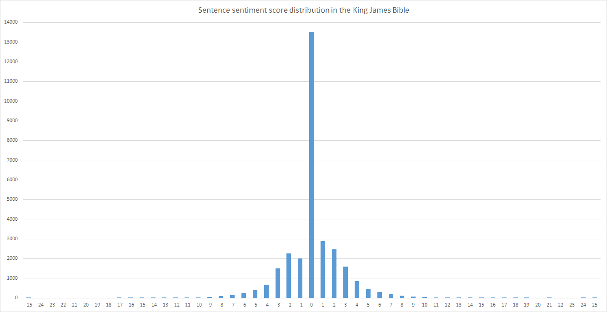

# :golf: Aims
- Score sentences in a source text by _POSITIVE_ or _NEGATIVE_ sentiment
- Find _best_ (most _POSITIVE_) and _worst_ (most _NEGATIVE_) sentences from the source text
- Plot sentence sentiment over time through the source text
- Plot sentence scores sorted from _best_ to _worst_ on a graph for distribution

# :telescope: Method
## Scoring sentences
Sentences were split using common punctuation delimiters and double spaces. A sentence is scored as the total of the scores of its words, e.g.:

_We were happy(**+3** :+1:) with the excellent(**+3** :+1:) service, but the boring(**-3** :-1:) music made us uncomfortable(**-2** :-1:)._

**Sentence score: +1 :+1:**

## Scoring words
I used a file called [AFINN](http://www2.imm.dtu.dk/pubdb/views/publication_details.php?id=6010) ([paper](https://arxiv.org/pdf/1103.2903v1.pdf)) which contains a list of words with a _POSITIVE_ or _NEGATIVE_ score.

Sentiment words have different scores to distinguish intensity - for example:

| :point_right: | Word | Score |
| ---- | ---- | ----- |
| :+1:  | outstanding | **+5** |
| :+1:  | fantastic | **+4** |
| :+1:  | delight | **+3** |
| :+1:  | advantage | **+2** |
| :+1:  | adequate | **+1** |
| :-1:  | alas | **-1** |
| :-1:  | upset | **-2** |
| :-1:  | violence | **-3** |
| :-1:  | catastrophic | **-4** |
| :-1:  | (expletives and racism) | **-5** |

It was made for analysing informal modern text (e.g. [Tweets](https://en.wikipedia.org/wiki/Twitter)) and contains slang, but I have mostly used it for old, public-domain texts and found it to be very reliable.

Unlisted words are scored **0**.

# :books: Analysis case studies
I mostly ran the analysis on public domain books from [Project Gutenberg] (https://www.gutenberg.org/). I also tried it out on movie scripts and a couple news articles. I am still adding to this section. :^)

## :european_castle: Case study: The Complete Works of Shakespeare
### Most positive sentences
| :point_right: | Sentence | Score | Source |
| ---- | ---- | ----- | ----- |
| :+1:  | None here, he hopes, In all this noble bevy, has brought with her One care abroad; he would have all as merry As, first, good company, good wine, good welcome, Can make good people. | **+23** | _Henry VIII_ |
| :+1:  | O wonderful, wonderful, most wonderful wonderful, and yet again wonderful, and after that, out of all whooping! | **+20** | _As You Like It_ |
| :+1:  | Tranio, since for the great desire I had To see fair Padua, nursery of arts, I am arriv'd for fruitful Lombardy, The pleasant garden of great Italy, And by my father's love and leave am arm'd With his good will and thy good company, My trusty servant well approv'd in all, Here let us breathe, and haply institute A course of learning and ingenious studies. | **+20** | _The Taming of the Shrew_ |

### Most negative sentences
| :point_right: | Sentence | Score | Source |
| ---- | ---- | ----- | ----- |
| :-1:  | Fear and be slain-no worse can come to fight; And fight and die is death destroying death, Where fearing dying pays death servile breath. | **-21** | _Richard II_ |
| :-1:  | Come down and welcome me to this world's light; Confer with me of murder and of death; There's not a hollow cave or lurking-place, No vast obscurity or misty vale, Where bloody murder or detested rape Can couch for fear but I will find them out; And in their ears tell them my dreadful name- Revenge, which makes the foul offender quake. | **-21** | _Titus Andronicus_ |
| :-1:  |  I'll put't in proof,  And when I have stol'n upon these sons-in-law,  Then kill, kill, kill, kill, kill, kill! | **-20** | _King Lear_ |

### :bar_chart: Chart: Sentiment score distribution

## :pray: Case study: King James Bible
### Most positive sentence
| :point_right: | Sentence | Score |
| ---- | ---- | ----- |
| :+1:  | 12:43 Also that day they offered great sacrifices, and rejoiced: for God had made them rejoice with great joy: the wives also and the children rejoiced: so that the joy of Jerusalem was heard even afar off. | **+25** |

### Most negative sentence
| :point_right: | Sentence | Score |
| ---- | ---- | ----- |
| :-1:  | 5:21 Ye have heard that it was said by them of old time, Thou shalt not kill; and whosoever shall kill shall be in danger of the judgment: 5:22 But I say unto you, That whosoever is angry with his brother without a cause shall be in danger of the judgment: and whosoever shall say to his brother, Raca, shall be in danger of the council: but whosoever shall say, Thou fool, shall be in danger of hell fire. | **-25** |

### :bar_chart: Graph: Sentiment throughout the King James Bible

Graphing sentiment over the sentences of the text does not seem to reveal anything interesting.
A couple reasons this might be the case:
* The graph is at the wrong level - there are so many sentences that there is too much detail - in this specific case, getting the average per book might be a better idea. In other cases, per-chapter or similar division could fulfill the same purpose
* The text is too varied - covering many topics in a somewhat haphazard manner
* Not enough information is present - sentiment is there, but there is no context, so some kind of interactive graph might be useful, in which you can mouse-over various spikes to see the analysed sentence(s)

### :bar_chart: Chart: Sentiment score distribution

## :christmas_tree: Case study: A Christmas Carol by Charles Dickens
### Most positive sentences
| :point_right: | Sentence | Score |
| ---- | ---- | ----- |
| :+1:  | He became as good a friend, as good a master, and as good a man, as the good old city knew, or any other good old city, town, or borough, in the good old world. | **+18** |
| :+1:  | And perhaps it was the pleasure the good Spirit had in showing off this power of his, or else it was his own kind, generous, hearty nature, and his sympathy with all poor men, that led him straight to Scrooge's clerk's; for there he went, and took Scrooge with him, holding to his robe; and on the threshold of the door the Spirit smiled, and stopped to bless Bob Cratchit's dwelling with the sprinkling of his torch. | **+16** |
| :+1:  | Wonderful party, wonderful games, wonderful unanimity, won-der-ful happiness! | **+15** |

### Most negative sentences
| :point_right: | Sentence | Score |
| ---- | ---- | ----- |
| :-1:  | Not a latent echo in the house, not a squeak and scuffle from the mice behind the panelling, not a drip from the half-thawed water-spout in the dull yard behind, not a sigh among the leafless boughs of one despondent poplar, not the idle swinging of an empty store-house door, no, not a clicking in the fire, but fell upon the heart of Scrooge with a softening influence, and gave a freer passage to his tears. | **-13** |
| :-1:  | At one of these a lonely boy was reading near a feeble fire; and Scrooge sat down upon a form, and wept to see his poor forgotten self as he used to be. | **-9** |
| :-1:  | He recoiled in terror, for the scene had changed, and now he almost touched a bed: a bare, uncurtained bed: on which, beneath a ragged sheet, there lay a something covered up, which, though it was dumb, announced itself in awful language. | **-9** |

### :bar_chart: Chart: Sentiment score distribution

## :hocho: Case study: War and Peace by Leo Tolstoy
### Most positive sentences
| :point_right: | Sentence | Score |
| ---- | ---- | ----- |
| :+1:  | Every young man who came to the house—seeing those impressionable, smiling young faces (smiling probably at their own happiness), feeling the eager bustle around him, and hearing the fitful bursts of song and music and the inconsequent but friendly prattle of young girls ready for anything and full of hope—experienced the same feeling; sharing with the young folk of the Rostóvs’ household a readiness to fall in love and an expectation of happiness. | **+19** |
| :+1:  | Only it seems to me that Christian love, love of one’s neighbor, love of one’s enemy, is worthier, sweeter, and better than the feelings which the beautiful eyes of a young man can inspire in a romantic and loving young girl like yourself. | **+18** |

### Most negative sentences
| :point_right: | Sentence | Score |
| ---- | ---- | ----- |
| :-1:  | Before partisan warfare had been officially recognized by the government, thousands of enemy stragglers, marauders, and foragers had been destroyed by the Cossacks and the peasants, who killed them off as instinctively as dogs worry a stray mad dog to death. | **-18** |
| :-1:  | It was not Napoleon alone who had experienced that nightmare feeling of the mighty arm being stricken powerless, but all the generals and soldiers of his army whether they had taken part in the battle or not, after all their experience of previous battles—when after one tenth of such efforts the enemy had fled—experienced a similar feeling of terror before an enemy who, after losing HALF his men, stood as threateningly at the end as at the beginning of the battle. | **-16** |

### :bar_chart: Chart: Sentiment score distribution

# :scissors: Technologies used
* Word/sentiment list: [AFINN](http://www2.imm.dtu.dk/pubdb/views/publication_details.php?id=6010) ([paper](https://arxiv.org/pdf/1103.2903v1.pdf))
* Language: Javascript
* Environment: Node.js
* Graphs: Microsoft Excel
* Libraries: None

# :eggplant: Acknowledgements
* [AFINN](http://www2.imm.dtu.dk/pubdb/views/publication_details.php?id=6010) word-sentiment list ([paper](https://arxiv.org/pdf/1103.2903v1.pdf)) - Finn Årup Nielsen
* [Project Gutenberg] (https://www.gutenberg.org/)
* [Emoji cheat sheet] (http://www.webpagefx.com/tools/emoji-cheat-sheet/) - WebpageFX